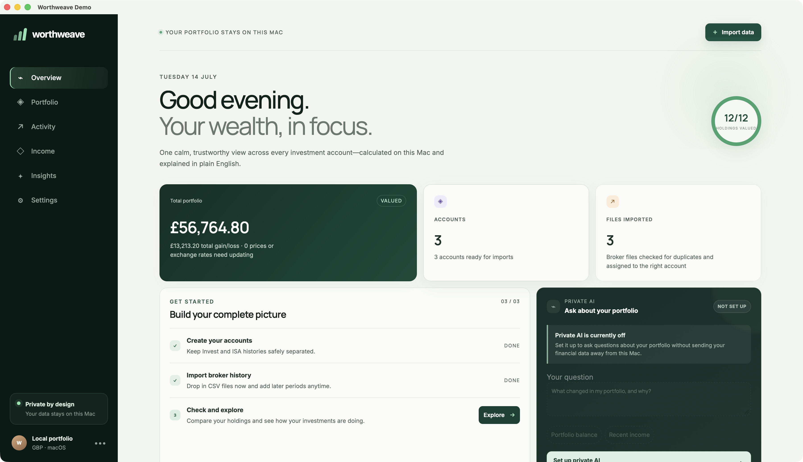
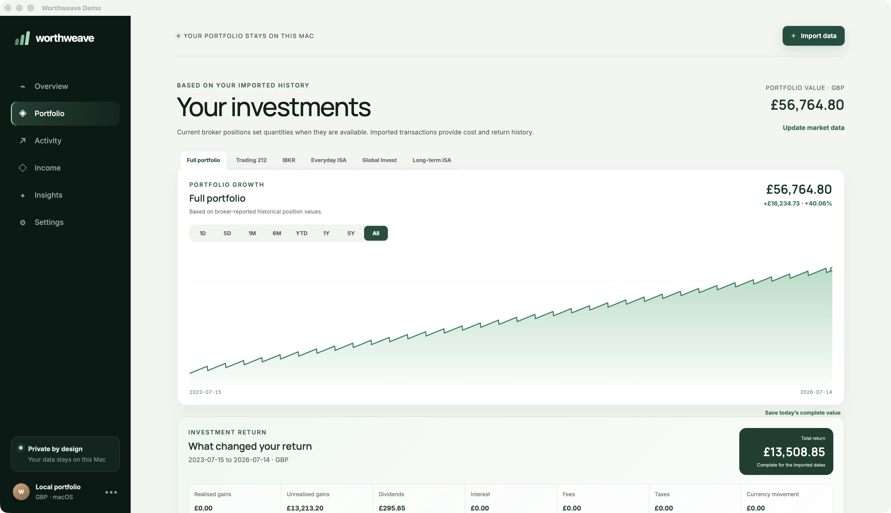

<p align="center">
  
</p>

<h1 align="center">Worthweave</h1>

<p align="center">
  Private, local-first portfolio analysis across supported investment brokers.
</p>

<p align="center">
  <a href="https://github.com/kabudu/worth-weave/actions/workflows/ci.yml"></a>
  <a href="https://github.com/kabudu/worth-weave/actions/workflows/macos-release.yml"></a>
  <a href="LICENSE"></a>
  
  
  
  
</p>

Worthweave brings investments held across Trading 212, Interactive Brokers, and Robinhood into one coherent macOS application. It reconstructs holdings from broker history, keeps every provider and account type separate, and reports portfolio value, performance, income, and allocation in a configurable reporting currency.

Planned reporting and analysis features are documented in the [product roadmap](ROADMAP.md).

Financial results come from deterministic Rust code using exact decimal representations. The optional local AI can explain those verified results, but it cannot create transactions, change the ledger, or substitute speculation for missing data.

## Preview

The screenshots below use Worthweave's isolated showcase profile and entirely fictional portfolio data.

### Overview



### Portfolio



## Highlights

- A consolidated view across Trading 212, Interactive Brokers, and Robinhood accounts.
- Account-aware CSV imports for Trading 212 and Interactive Brokers.
- Verified read-only Trading 212 API support for Invest and Stocks and Shares ISA accounts, synchronising official history exports and current positions without manual CSV uploads.
- Region-aware Robinhood UK and US account tracking, with imports enabled as export schemas are validated.
- Separate histories for each provider, account, and tax wrapper—including general investment accounts, Stocks and Shares ISAs, and supported US brokerage and retirement accounts.
- Exact quantities, cost basis, average cost, value, and gain/loss calculations.
- Allocation by broker, account, asset class, sector, geography, and source currency.
- Transaction, dividend, interest, and valuation-snapshot history.
- True total-return attribution across realised and unrealised gains, dividends, interest, fees, and taxes, with explicit data-completeness diagnostics.
- Position comparison against the latest broker-reported holdings.
- Configurable reporting currency without rewriting source transactions.
- Human-readable JSON export plus encrypted, versioned backup and restore.
- Optional device-tuned local AI through Rapid-MLX or Ollama.
- Signed in-app updates with a clear install-and-restart prompt.
- Native Apple Silicon macOS application with no Python runtime or web server.

## First run

Onboarding keeps setup short and reversible:

1. Choose the reporting currency used for consolidated totals and performance.
2. Select providers and account types to track so every account and tax wrapper remains separate.
3. Accept or skip the local AI recommendation generated for the Mac's hardware.
4. Import broker CSV exports; Worthweave checks file hashes and transaction identifiers to prevent duplicates.

Trading 212 Invest and Stocks and Shares ISA accounts can instead be connected in **Settings → Broker connections**. Create a separate Trading 212 API key for each account with account, portfolio and history read permissions, then enter its key and secret. Worthweave validates the connection directly with Trading 212 and stores the credentials in macOS Keychain. It never requests order or trading permissions.

The first sync imports Trading 212's official history export and current position snapshot. Subsequent syncs are idempotent, so existing activity is not duplicated. Worthweave checks connected accounts when the app opens if the last successful sync is more than a day old, resumes unfinished reports, preserves progress through Trading 212 rate limits, and keeps manual CSV import available as a fallback.

Prices and investment categories are configured after import, when Worthweave knows which holdings require them. Worthweave refreshes official ECB reference exchange rates automatically and keeps manual rates available as overrides. All preferences can be revisited in Settings.

## Privacy and financial integrity

- Portfolio data is stored in a local SQLite database with owner-only filesystem permissions.
- Broker CSV files are parsed locally and never require credentials. Optional API connections store credentials only in macOS Keychain.
- Imported source records are immutable.
- Missing history, prices, or exchange rates produce explicit partial or unavailable states rather than estimates.
- Local AI requests are restricted to loopback services and grounded in application-calculated analytics.
- Backups are encrypted with a user-supplied password that Worthweave never stores.

Worthweave is portfolio-analysis software, not financial advice. Local AI explanations must not be treated as price predictions or recommendations to trade.

## Technology

- [Tauri 2](https://tauri.app/) and Rust for the native application, broker adapters, calculations, and SQLite storage.
- React, TypeScript, TanStack Query, and Zod for the interface and native-command boundary.
- Tailwind CSS design tokens with purpose-built component styling.
- Locally bundled Manrope Variable and Inter Variable WOFF2 fonts; no remote font requests.
- Rapid-MLX or Ollama for optional local model inference.

The repository pins its Rust toolchain and JavaScript dependencies for reproducible builds.

## Development

Requirements:

- macOS 13 or later.
- Node.js 22 or later.
- pnpm 11.13.0.
- Rust 1.97.0, installed automatically from `rust-toolchain.toml` when using rustup.

Install dependencies and start the native development application:

```bash
pnpm --dir frontend install --frozen-lockfile
frontend/node_modules/.bin/tauri dev
```

Private broker exports belong in `.dev/`. That directory is excluded from source control.

## Validation

```bash
cargo fmt --manifest-path src-tauri/Cargo.toml --check
cargo test --manifest-path src-tauri/Cargo.toml --locked
cargo clippy --manifest-path src-tauri/Cargo.toml --all-targets --all-features --locked -- -D warnings
pnpm --dir frontend test
pnpm --dir frontend lint
pnpm --dir frontend build
pnpm --dir frontend test:e2e
```

The end-to-end suite exercises first-run onboarding, navigation, imports, settings, portfolio reporting, and automated accessibility checks.

## macOS builds and releases

Create local `.app` and `.dmg` bundles with:

```bash
frontend/node_modules/.bin/tauri build
```

Pushing a changelog-backed `vMAJOR.MINOR.PATCH` tag runs `.github/workflows/macos-release.yml`. It imports the Developer ID certificate into an ephemeral keychain, runs the release gates, signs and notarises the application, verifies Gatekeeper and stapled tickets, publishes the matching Rust crate to crates.io, creates the GitHub Release from the matching changelog section, and publishes the DMG with its SHA-256 checksum. It also publishes a separately signed updater archive and manifest used by Worthweave’s in-app update prompt.

See the [release process](docs/release.md) for required GitHub secrets and variables.

## Documentation

- [Architecture and data model](docs/architecture.md)
- [Broker import contract](docs/data-imports.md)
- [Security model](docs/security.md)
- [Release process](docs/release.md)
- [v1 completion contract](docs/roadmap.md)
- [Product roadmap](ROADMAP.md)
- [Changelog](CHANGELOG.md)
- [Contributing](CONTRIBUTING.md)
- [Security policy](SECURITY.md)
- [Support](SUPPORT.md)
- [Governance](GOVERNANCE.md)
- [Code of conduct](CODE_OF_CONDUCT.md)
- [Open-source readiness](docs/open-source-readiness.md)

## Contributing

Issues and pull requests are welcome. Read [CONTRIBUTING.md](CONTRIBUTING.md) before starting, use synthetic financial fixtures only, and report vulnerabilities privately according to [SECURITY.md](SECURITY.md).

## License

Worthweave is licensed under the [Apache License 2.0](LICENSE). It is permissive and includes an explicit patent grant from contributors. See the license for its preservation, attribution, and change-notice requirements.

Worthweave bundles Inter and Manrope under the SIL Open Font License 1.1. Their copyright notices and license terms are included in [Third-party notices](src-tauri/resources/THIRD_PARTY_NOTICES.md) and in every packaged application bundle.
